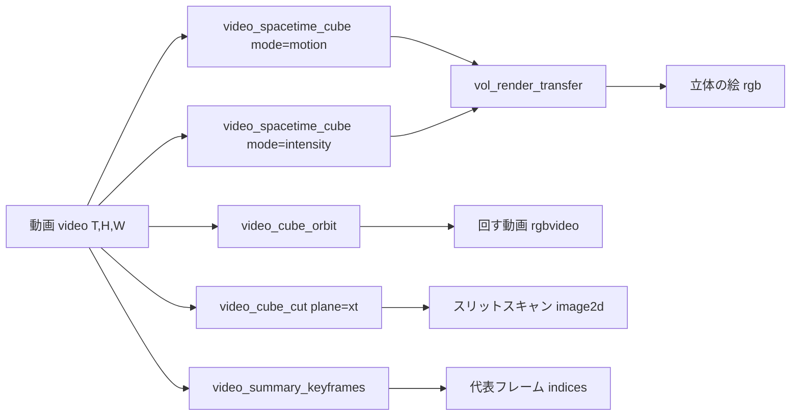

# 動画を空間 × 時間の立方体として見る(Video Summagator の再実装) — 使い方ガイド

## この族は何をする道具箱か

Nguyen・Niu・Liu「Video Summagator: An Interface for Video Summarization and Navigation」(ACM CHI 2012)は、動画 (T, H, W) を (x, y, t) の立方体にし、**動かない背景を薄く・動く物体を濃く**するボリュームレンダリングで「何が・どこを・いつ通ったか」を 1 枚の立体に見せ、切ったり回したりして目当ての場面へ飛ぶ道具でした。深層学習は使いません。この族はそれを numpy + scipy.ndimage だけで再実装したものです(公開コードは無いので、論文の考えからの再実装)。

6 op / 4 カテゴリ(台帳は `opsvideocube.py`、実体は `videocube.py`、新しい型は作らない):

- **cube(2)** — `video_spacetime_cube`(動画 → 立方体 `voxel`。`mode="motion"` は時間差分の大きさ = 不透明度の元、`"dark"` / `"bright"` は暗い / 明るい所 = **z スタック**(EM の連続断面の膜、蛍光の細胞)を同じ立方体として見るため、`"intensity"` は明るさ = 色の元)/ `video_cube_cut`(断面 `image2d`: `"xt"` = スリットスキャン、`"yt"`、`"xy"` = 1 フレーム)。
- **render(2)** — `vol_render_transfer`(任意視点の**前から後ろへの α 合成** `rgb`。軌跡は時刻の色(青 = 始め → 赤 = 終わり)、`static_alpha` で静止した背景を薄く重ねる)/ `video_cube_orbit`(立方体を回す `rgbvideo`、`mode` で動画 / z スタックを選ぶ)。
- **summary(1)** — `video_summary_keyframes`(動きの量 + 場面の変化から代表フレームの添字 `indices`)。
- **export(1)** — `video_write_gif`(`rgbvideo` か灰の `video` をアニメーション GIF に。全フレームを保存し、書いた後に枚数を読み戻す。使い回しの出口)。

ハエの脳の EM 断面を積んだスタックも、先頭軸を時刻でなく奥行きと読むだけで同じ道具で見えます(`mode="dark"`、PoC の図 6)。

既存の `render_volume_projection`(X 線 / MIP)では背景と動きを分けられず、`videostream` の時間フィルタは 1 フレームずつしか返さないので、その間を埋めます。

## 連鎖



```python
import fullseye as fs
L = fs.ledger

alpha = L.video_spacetime_cube(clip, "motion")                 # 動く物体だけが立つ [0, 1]
color = L.video_spacetime_cube(clip, "intensity")
rgb = L.vol_render_transfer(alpha, color=None, yaw=35, pitch=22, static_alpha=0.12)   # 軌跡 = 時刻の色
frames = L.video_cube_orbit(clip, n_frames=36, size=320)        # 回す
slit = L.video_cube_cut(clip, "xt", position=0.4)               # 4 割目の行を「いつ何が横切ったか」
idx = L.video_summary_keyframes(clip, k=4)                      # 何かが起きたフレーム
```

## 読み方

- **x–t 断面(スリットスキャン)**: 右へ動く物体は右下がりの筋、止まっている物体は縦の帯。筋の最初の行が出現時刻、**傾きが速度**(px/frame)。PoC では既知の 3 物体の出現時刻が ±1 フレーム、速度が真値に合うことを確かめています。
- **時刻の色**: 青 → 緑 → 黄 → 赤の順序で、良否ではなく時間を言います。正面(yaw = 0)から見ると全フレームの軌跡が 1 枚に重なり、側面(yaw = 90)から見ると時間軸に沿って伸びます。
- **static_alpha**: 立方体の最長辺を貫いたときの合計の不透明度で、サンプル数や視線の向きに依りません。0.1〜0.2 で背景がうっすら透け、軌跡の位置が読めます。

## 型の話

動画は既存の `video`(T, H, W)、立方体は既存の `voxel`(3-D 配列)。時間軸が先頭にあるだけで、3-D の op(`vol_mip` など)に渡しても意味のある投影が出るので分けません。絵は `rgb`、回す動画は `rgbvideo`(conngraph の `points_activity_video` と同じ出口)、断面は `image2d`、添字は `indices`。Studio では Tools ▸ Video cube が同じ部品で対話的に動きます(ドラッグで回転、断面の位置をスライダ、断面をクリックでそのフレームへ)。
