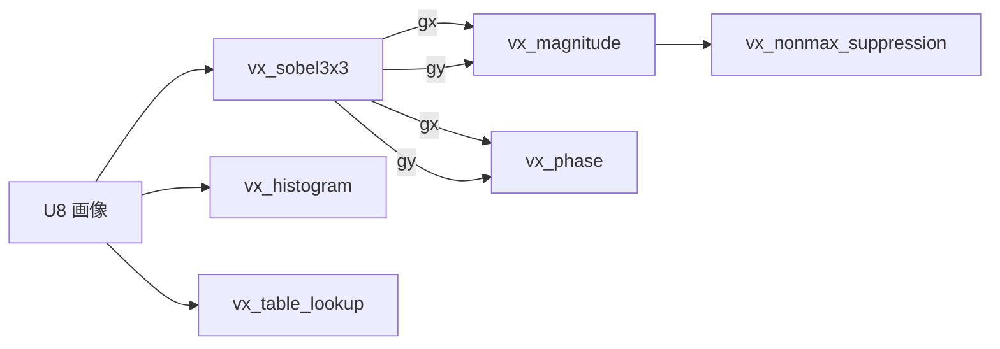

# OpenVX の素の口 — 使い方ガイド

Copyright (c) 2026 Kazufumi Furuse.

## この族は何をする道具箱か

OpenVX 1.3.1(Khronos の視覚処理 API の規格)は、視覚関数ごとに**何を受け取り何を返すか**を番号つきの規範文 [REQ-NNNN] で決めています。
2026-09-25 に 61 本を本文まで読んで照合したら、17 本は「Fullseye にも似た op はあるが、入口か出口の形が違う」でした。たとえば `sobel_mag` は
大きさを [0, 1] に正規化して返すので、規格の順序 —— Sobel で gx と gy を出し、別々に大きさと位相へ —— では使えません。

この族は、その**素の口**を規範文どおりに開けます(合成 op は消しません)。第 1 陣 6 op と第 2 陣 4 op:

- **gradient(3)** — `vx_sobel3x3`(REQ-0415 の核で gx・gy を別々に、境界は必須の引数)/ `vx_magnitude`(REQ-0270: `uint16(sqrt(x²+y²) + 0.5)`、32767 で飽和)/
  `vx_phase`(REQ-0364: 0 ≤ ϕ < 2π を 0〜255 へ。★規格は丸めを決めていないので `mapping="floor"|"round"` を呼び手が選ぶ)。
- **pixel(2)** — `vx_table_lookup`(REQ-0421: 任意の表を引く、S16 は offset を足して引く、表の外は止める)/ `vx_histogram`(REQ-0230: `(I − offset) × numBins / range` の升)。
- **suppress(1)** — `vx_nonmax_suppression`(REQ-0337: 窓の中で**前の隣には ≥、後ろの隣には >** で勝てば残る。マスクの画素は比べない REQ-0336、抑制した S16 は INT16_MIN REQ-0335)。

- **geometry(3)** — `vx_warp_affine`(REQ-0498)/ `vx_warp_perspective`(REQ-0508)/ `vx_remap`(REQ-0392): どれも**逆写像**(出力の画素がどこから来るか)。標本は画素の中心、補間は最近傍か双線形、境界は UNDEFINED か CONSTANT だけ(REQ-0506)。★規格の C の宣言は行列を転置した並び(`mat[3][2]`)で持つので、そのまま渡すと形が (3, 2) になって止まります —— 渡すのは数学の並びの 2×3。
- **filter(1)** — `vx_nonlinear_filter`(REQ-0325〜0330): 任意の形のマスクで中央値・最小(収縮)・最大(膨張)。マスクの画素数が偶数のときの中央値は規格に無いので上側(`n // 2` 番目)を取ります。

画像は U8 / S16 の dtype を規格どおりに受け、合わなければ止めます(黙って丸めません)。

## 代表的なパイプライン



## 使い方(最小の 1 本)

```python
import numpy as np
import vxcore as V

img = np.zeros((7, 9), np.uint8)
img[:, 4:] = 100                                                   # 縦の段差(左 0 → 右 100)
g = V.vx_sobel3x3(img, border="replicate")                         # REQ-0415 の核、gx と gy を別々に
print(g["gx"][3, 2:7].tolist(), int(g["gy"].max()))      # [0, 400, 400, 0, 0] 0
mag = V.vx_magnitude(g["gx"], g["gy"])                             # REQ-0270: sqrt + 0.5 を切り捨て、32767 で飽和
print(mag[3, 3:5].tolist(), V.vx_phase(g["gx"], g["gy"], mapping="floor")[3, 3])   # [400, 400] 0(右向きの勾配 = 位相 0)
peaks = V.vx_nonmax_suppression(mag, window=3)                     # REQ-0337: 前の隣に ≥、後ろの隣に >
print(int((peaks > 0).sum()))          # 1 —— 幅 2・長さ 7 の平らな稜線が右下の 1 画素に潰れる
print(V.vx_histogram(img, num_bins=4, offset=0, range_=256)[:, 1].tolist())        # [28.0, 35.0, 0.0, 0.0] —— REQ-0230 の升
```

## 気をつけること

- **非極大の抑制は「点」のための op です。** ≥ と > の非対称のおかげで平らな頂上から 1 画素だけが残りますが、同じ理由で、**平らな稜線(エッジ)も
  1 画素に潰れます**(上の例: 幅 2・長さ 7 の稜線が 1 画素)。エッジを細くしたいときは勾配の向きに沿って比べる Canny の段(`hx_nonmax_dir`)を使います。
- **位相の丸めは規格が決めていません。** `floor` と `round` は 2π の直前で 255 と 0 に分かれます。他の実装と突き合わせるときは、どちらかを確かめてから。
- **最近傍のちょうど真ん中。** 規格は「中心がいちばん近い画素」としか書いていないので、x.5 は +∞ 側(⌊x + 0.5⌋)に寄せています。偶数丸めの実装とは半画素ずれた行列で答えが分かれます(試験で壊した版が落ちることを確かめてあります)。
- **双線形の CONSTANT は「外の近傍を定数とみなす」。** scipy の `map_coordinates(mode="constant")` は標本点が格子の外に出ると丸ごと定数にするので、縁の 1 画素で食い違います。同じ約束は `mode="grid-constant"`。
- **大きさの 0.5 の足し方。** 整数の x² + y² の平方根はちょうど n + 0.5 にならないので、REQ-0270 の「+ 0.5 して切り捨て」と四捨五入は整数の入力では常に同じ答えです。

## 真値

試験(`tests/test_vxcore.py`)は、規範文の式を**画素ごとの素朴なループ**で写した別の実装と突き合わせます: Sobel は scipy の相関、大きさは REQ-0270 の C の式、
位相は `math.atan2`、ヒストグラムは REQ-0230 の式、非極大の抑制は 3.39 節の 8 つの不等式。≥ と > を入れ替えた壊れた版で 3 件落ちることも確かめてあります。
