<div class="vlang" markdown="1">

[日本語](../index.md) · **English** · [简体中文](../zh/index.md) · [繁體中文](../tw/index.md) · [한국어](../ko/index.md) · [Deutsch](../de/index.md) · [हिन्दी](../hi/index.md)

</div>

# Fullseye — ViEW2026

Physics simulation and image processing, combined with AI and checked against ground truth.

Tap a tile to open the video or figure (▶ = moving).

<style>
.vlang { font-size: 14px; line-height: 2; }
.vg { display: grid; grid-template-columns: repeat(2, minmax(0, 1fr)); gap: 8px; margin: 12px 0 20px; }
.vg.vs { grid-template-columns: repeat(3, minmax(0, 1fr)); gap: 6px; }
@media (min-width: 600px) { .vg { grid-template-columns: repeat(3, minmax(0, 1fr)); } .vg.vs { grid-template-columns: repeat(5, minmax(0, 1fr)); } }
@media (min-width: 900px) { .vg { grid-template-columns: repeat(4, minmax(0, 1fr)); } .vg.vs { grid-template-columns: repeat(7, minmax(0, 1fr)); } }
.vg a, .vser a { display: block; position: relative; text-decoration: none; color: inherit; }
.vg img { display: block; width: 100%; max-width: 100%; height: auto; aspect-ratio: 1 / 1; object-fit: cover; border-radius: 6px; background: #222; }
.vg b { position: absolute; top: 6px; right: 6px; background: rgba(0,0,0,.6); color: #fff; font-size: 12px; padding: 1px 6px; border-radius: 9px; }
.vg span { display: block; font-size: 13px; line-height: 1.3; margin-top: 3px; }
.vg.vs span { font-size: 11px; }
.vser { display: grid; grid-template-columns: repeat(2, minmax(0, 1fr)); gap: 8px; margin: 12px 0 20px; }
@media (min-width: 600px) { .vser { grid-template-columns: repeat(3, minmax(0, 1fr)); } }
.vser img { display: block; width: 100%; max-width: 100%; height: auto; aspect-ratio: 16 / 9; object-fit: cover; border-radius: 8px; background: #222; }
.vser strong { display: block; font-size: 14px; margin-top: 3px; line-height: 1.3; }
.vser span { display: block; font-size: 12px; line-height: 1.3; }
details.vall { margin: 6px 0; }
details.vall > summary { font-size: 15px; padding: 6px 0; cursor: pointer; }
.vl li { margin-bottom: 8px; }
</style>

## Highlights

<div class="vg">
<a href="../../articles/assets/poc/poc_real_defect_floor/02_defect_floor_sweep.gif"><b>&#9654;</b><span>Faint-defect limit</span></a>
<a href="../../articles/assets/poc/poc_active_contours/06_u_shape_snakes.mp4"><b>&#9654;</b><span>Active contours</span></a>
<a href="../../articles/assets/poc/poc_dic_strain/05_tensile_ramp.mp4"><b>&#9654;</b><span>DIC strain</span></a>
<a href="../../articles/assets/poc/poc_focus_stacking/05_focus_sweep.mp4"><b>&#9654;</b><span>Focus stacking</span></a>
<a href="../../articles/assets/poc/poc_registration_basin/05_icp_basin_iterations.mp4"><b>&#9654;</b><span>Point-cloud ICP</span></a>
<a href="../../articles/assets/poc/poc_stockpile_volume/07_scan_orbit.mp4"><b>&#9654;</b><span>Stockpile volume</span></a>
<a href="../../articles/assets/poc/poc_ct_fidelity/01_recon_sweep.png"><span>CT reconstruction</span></a>
<a href="../../articles/assets/poc/poc_ct_void_morphology/13_section_sweep.mp4"><b>&#9654;</b><span>CT voids</span></a>
<a href="../../articles/assets/poc/poc_interferometry_step/05_step_sweep.mp4"><b>&#9654;</b><span>White-light steps</span></a>
<a href="../../articles/assets/poc/poc_polarization_specular/03_separation.png"><span>Polarization</span></a>
<a href="../../articles/assets/poc/poc_photoelasticity/03_load_and_isoclinics.mp4"><b>&#9654;</b><span>Photoelasticity</span></a>
<a href="../../articles/assets/poc/poc_thermography_ndt/02_depth_map.png"><span>Thermography NDT</span></a>
<a href="../../articles/assets/poc/poc_motion_magnification/05_magnify_video.mp4"><b>&#9654;</b><span>Motion magnification</span></a>
<a href="../../articles/assets/poc/poc_table_tennis_bounce/01_drop_test.mp4"><b>&#9654;</b><span>Ping-pong bounce</span></a>
<a href="../../articles/assets/poc/poc_compound_eye/02_compound_eye_superposition.png"><span>Compound eye</span></a>
<a href="../../articles/assets/poc/poc_pegsim_insertion/04_pegsim_insert_corrected.gif"><b>&#9654;</b><span>Peg-in-hole</span></a>
<a href="../../articles/assets/poc/poc_air_hockey_intercept/02_airhockey_prediction_cone_narrows.gif"><b>&#9654;</b><span>Air hockey</span></a>
<a href="../../articles/assets/poc/poc_tacsim_elastic_membrane/03_tacsim_force_sweep.gif"><b>&#9654;</b><span>Tactile sensor</span></a>
<a href="../../articles/assets/poc/poc_table_tennis_spin/01_side_three_serves.mp4">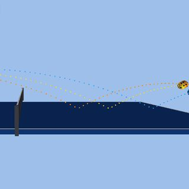<b>&#9654;</b><span>Ping-pong spin</span></a>
<a href="../../articles/assets/poc/poc_table_tennis_rally_loop/02_height_misread.mp4">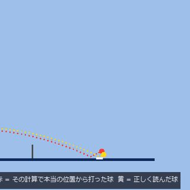<b>&#9654;</b><span>Rally and misreads</span></a>
<a href="../../articles/assets/poc/poc_driving_traffic/01_dashcam_occlusion.mp4">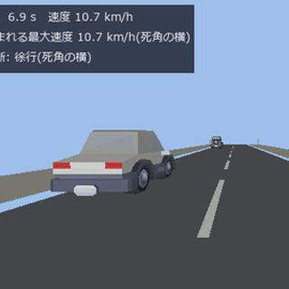<b>&#9654;</b><span>Traffic, blind spots</span></a>
<a href="../../articles/assets/poc/poc_driving_crossing/01_crossing_dashcam.mp4">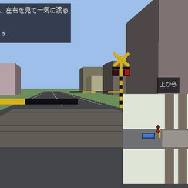<b>&#9654;</b><span>Level crossings</span></a>
<a href="../../articles/assets/poc/poc_driving_pass/03_mirror_tjunction.mp4">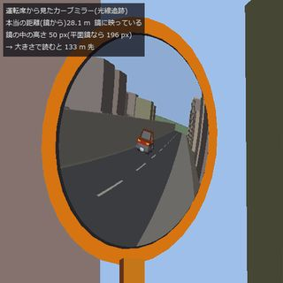<b>&#9654;</b><span>Curve mirror</span></a>
<a href="../../articles/assets/poc/poc_ttc_rss/06_approach_gif.gif">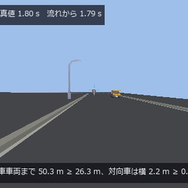<b>&#9654;</b><span>TTC and RSS</span></a>
<a href="../../articles/assets/poc/poc_eye_to_brain/01_eye_sweep.gif">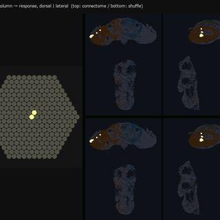<b>&#9654;</b><span>Eye to brain</span></a>
<a href="../../articles/assets/poc/poc_malecns_activity_wave/01_activity_wave_connectome_vs_shuffle.gif">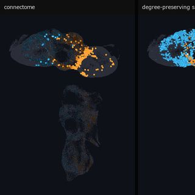<b>&#9654;</b><span>Fly brain wave</span></a>
<a href="../../articles/assets/poc/poc_microns_brain_wave/04_wave_on_wiring.gif">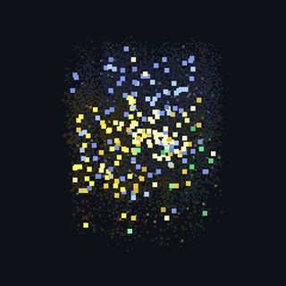<b>&#9654;</b><span>Mouse cortex wave</span></a>
<a href="../../articles/assets/media/evis_stereo_fullseye.mp4">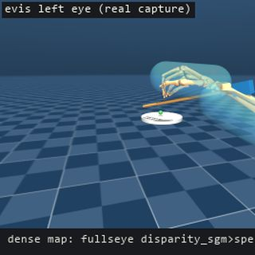<b>&#9654;</b><span>Humanoid stereo eyes</span></a>
<a href="../../articles/assets/media/evis_bean_track_fullseye.mp4">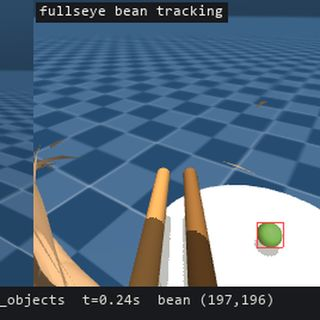<b>&#9654;</b><span>Chopstick-cam tracking</span></a>
</div>

## Article series (articles on Qiita)

<div class="vser">
<a href="https://qiita.com/furuse-kazufumi/items/8a8f23e53b19ee8cdc10">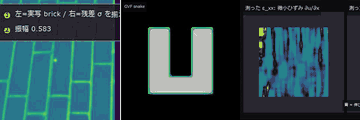<strong>A Metrology Museum on Paper</strong><span>Every PoC with its own planted ground truth</span></a>
<a href="https://qiita.com/furuse-kazufumi/items/a82bf9f341cc4f04ca75">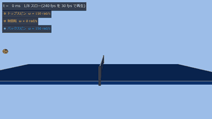<strong>Table tennis</strong><span>Bounce and friction measured from video</span></a>
<a href="https://qiita.com/furuse-kazufumi/items/05de90f4d316cd7c681c">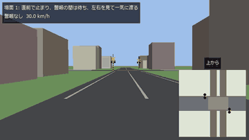<strong>Autonomous driving</strong><span>Scored by theorems and second implementations</span></a>
<a href="https://qiita.com/furuse-kazufumi/items/638f0b0aa7865e17c67c">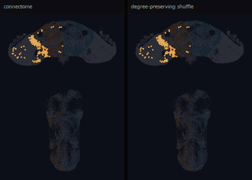<strong>Connectome (brain wiring)</strong><span>A fly visual model on a body, measured</span></a>
<a href="https://qiita.com/furuse-kazufumi/items/569720dbae0c6471c96e">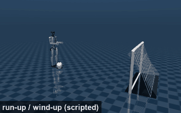<strong>Humanoid sports day</strong><span>A home sports day refereed by image processing</span></a>
</div>

## What it can do

35 topics, each with an explanation page (how to use it, and its limits) and runnable examples.

<div class="vl" markdown="1">

**Find**

- Segment regions, select them, and count: [explanation](../../capabilities/blob-and-region.md) _(ja)_ · examples [poc_cell_counting](https://github.com/furuse-kazufumi/fullseye/blob/master/examples/poc_cell_counting.py) · [poc_particle_sizing](https://github.com/furuse-kazufumi/fullseye/blob/master/examples/poc_particle_sizing.py) · [poc_real_coin_metrology](https://github.com/furuse-kazufumi/fullseye/blob/master/examples/poc_real_coin_metrology.py)
- Fix the text inside an image against the string it should read: [explanation](../../capabilities/fix-text-in-images.md) _(ja)_ · examples [fix_text_in_image](https://github.com/furuse-kazufumi/fullseye/blob/master/examples/fix_text_in_image.py) · [poc_glyph_typo_detection](https://github.com/furuse-kazufumi/fullseye/blob/master/examples/poc_glyph_typo_detection.py)
- Find small point-like targets and locate them below the pixel: [explanation](../../capabilities/point-target-detection.md) _(ja)_ · examples [poc_search_sweep_width](https://github.com/furuse-kazufumi/fullseye/blob/master/examples/poc_search_sweep_width.py) · [poc_astro_photometry](https://github.com/furuse-kazufumi/fullseye/blob/master/examples/poc_astro_photometry.py)

**Measure**

- Estimate the camera intrinsic matrix K from multiple planar views (Zhang): [explanation](../../capabilities/camera-intrinsics-calibration.md) _(ja)_ · examples [camera_intrinsics_calibration](https://github.com/furuse-kazufumi/fullseye/blob/master/examples/camera_intrinsics_calibration.py)
- Seeing the complex plane as an area (domain colouring, basins, escape time, flow): [explanation](../../capabilities/complex-plane-fields.md) _(ja)_ · examples [poc_complex_plane_fields](https://github.com/furuse-kazufumi/fullseye/blob/master/examples/poc_complex_plane_fields.py)
- Estimate lens distortion coefficients from straight lines (plumb-line, no board): [explanation](../../capabilities/estimate-lens-distortion.md) _(ja)_ · examples [estimate_lens_distortion](https://github.com/furuse-kazufumi/fullseye/blob/master/examples/estimate_lens_distortion.py)
- Put measurements on the Earth (ECEF, height frames, local ENU): [explanation](../../capabilities/geodetic-frames.md) _(ja)_ · examples [poc_geodetic_height_frames](https://github.com/furuse-kazufumi/fullseye/blob/master/examples/poc_geodetic_height_frames.py) · [poc_geodetic_benchmarks_real](https://github.com/furuse-kazufumi/fullseye/blob/master/examples/poc_geodetic_benchmarks_real.py) · [dem_geodesy_tour](https://github.com/furuse-kazufumi/fullseye/blob/master/examples/dem_geodesy_tour.py)
- How much of that number is your measuring, not your process (gauge R&R and measurement uncertainty): [explanation](../../capabilities/measurement-system-and-uncertainty.md) _(ja)_ · examples [poc_measurement_system_analysis](https://github.com/furuse-kazufumi/fullseye/blob/master/examples/poc_measurement_system_analysis.py)
- Measure dimensions from an image, below the pixel: [explanation](../../capabilities/subpixel-2d-metrology.md) _(ja)_ · examples [poc_dimensional_inspection](https://github.com/furuse-kazufumi/fullseye/blob/master/examples/poc_dimensional_inspection.py) · [poc_screw_thread_metrology](https://github.com/furuse-kazufumi/fullseye/blob/master/examples/poc_screw_thread_metrology.py) · [poc_calipers_under_illusion](https://github.com/furuse-kazufumi/fullseye/blob/master/examples/poc_calipers_under_illusion.py)
- Slope, flow and line of sight on a terrain: [explanation](../../capabilities/terrain-and-visibility.md) _(ja)_ · examples [poc_dem_terrain](https://github.com/furuse-kazufumi/fullseye/blob/master/examples/poc_dem_terrain.py) · [dem_terrain_analysis_tour](https://github.com/furuse-kazufumi/fullseye/blob/master/examples/dem_terrain_analysis_tour.py)
- Turn a 3-D scan into a volume: [explanation](../../capabilities/volume-from-3d-scan.md) _(ja)_ · examples [poc_stockpile_volume](https://github.com/furuse-kazufumi/fullseye/blob/master/examples/poc_stockpile_volume.py) · [poc_lidar_terrain_change](https://github.com/furuse-kazufumi/fullseye/blob/master/examples/poc_lidar_terrain_change.py)
- What a picture cannot check (integrator order, Lyapunov spectrum, bifurcations, correlation dimension, minimal surfaces): [explanation](../../capabilities/what-a-picture-cannot-check.md) _(ja)_ · examples [poc_what_a_picture_cannot_check](https://github.com/furuse-kazufumi/fullseye/blob/master/examples/poc_what_a_picture_cannot_check.py)

**Light and colour**

- Measure colour (XYZ / Lab / colour difference): [explanation](../../capabilities/colour-and-delta-e.md) _(ja)_ · examples [poc_white_balance](https://github.com/furuse-kazufumi/fullseye/blob/master/examples/poc_white_balance.py) · [poc_pigment_unmixing](https://github.com/furuse-kazufumi/fullseye/blob/master/examples/poc_pigment_unmixing.py)
- Compute reflection, refraction and interference: [explanation](../../capabilities/optics-and-materials.md) _(ja)_ · examples [glass_and_mirror_optics](https://github.com/furuse-kazufumi/fullseye/blob/master/examples/glass_and_mirror_optics.py) · [appearance_structural_colour](https://github.com/furuse-kazufumi/fullseye/blob/master/examples/appearance_structural_colour.py)
- Read a polarisation camera's raw frame into Stokes, DoLP and Mueller: [explanation](../../capabilities/polarization-imaging.md) _(ja)_ · examples [polarization_camera_pipeline](https://github.com/furuse-kazufumi/fullseye/blob/master/examples/polarization_camera_pipeline.py) · [poc_polarization_specular](https://github.com/furuse-kazufumi/fullseye/blob/master/examples/poc_polarization_specular.py)
- Turn a Bayer raw frame into a display image, one explainable stage at a time: [explanation](../../capabilities/raw-to-display-isp.md) _(ja)_ · examples [raw_to_display_isp](https://github.com/furuse-kazufumi/fullseye/blob/master/examples/raw_to_display_isp.py)

**Waves and signals**

- Beamform for direction, separate range from velocity: [explanation](../../capabilities/beamforming-and-range-doppler.md) _(ja)_ · examples [poc_multibeam_bathymetry](https://github.com/furuse-kazufumi/fullseye/blob/master/examples/poc_multibeam_bathymetry.py) · [poc_bev_sensor_fusion](https://github.com/furuse-kazufumi/fullseye/blob/master/examples/poc_bev_sensor_fusion.py)
- One beat (membrane modes, fringes, diffraction orders, print moire, and turning tone into ink): [explanation](../../capabilities/beats-fringes-and-screens.md) _(ja)_ · examples [poc_beats_fringes_and_screens](https://github.com/furuse-kazufumi/fullseye/blob/master/examples/poc_beats_fringes_and_screens.py)
- Diagnose faults from vibration and sound: [explanation](../../capabilities/vibration-and-acoustics.md) _(ja)_ · examples [poc_bearing_diagnosis](https://github.com/furuse-kazufumi/fullseye/blob/master/examples/poc_bearing_diagnosis.py) · [poc_rail_corrugation](https://github.com/furuse-kazufumi/fullseye/blob/master/examples/poc_rail_corrugation.py)

**Reconstruct and correct**

- Correct lens distortion over a whole image (barrel, pincushion, tangential): [explanation](../../capabilities/lens-distortion-correction.md) _(ja)_ · examples [lens_undistort](https://github.com/furuse-kazufumi/fullseye/blob/master/examples/lens_undistort.py)
- Reconstruct slices from projections (CT): [explanation](../../capabilities/tomography-reconstruction.md) _(ja)_ · examples [poc_ct_fidelity](https://github.com/furuse-kazufumi/fullseye/blob/master/examples/poc_ct_fidelity.py) · [poc_ct_void_morphology](https://github.com/furuse-kazufumi/fullseye/blob/master/examples/poc_ct_void_morphology.py)
- Carve a solid out of silhouettes (visual hull): [explanation](../../capabilities/visual-hull-from-silhouettes.md) _(ja)_ · examples [space_carving](https://github.com/furuse-kazufumi/fullseye/blob/master/examples_3d/space_carving.py) · [poc_livestock_body_volume](https://github.com/furuse-kazufumi/fullseye/blob/master/examples/poc_livestock_body_volume.py)

**Build a workflow**

- Align and stack: [explanation](../../capabilities/align-and-stack.md) _(ja)_ · examples [poc_astro_photometry](https://github.com/furuse-kazufumi/fullseye/blob/master/examples/poc_astro_photometry.py) · [poc_registration_basin](https://github.com/furuse-kazufumi/fullseye/blob/master/examples/poc_registration_basin.py)
- Compare against a golden image — align, diff, count defects, judge the lot: [explanation](../../capabilities/golden-compare.md) _(ja)_ · examples [golden_compare](https://github.com/furuse-kazufumi/fullseye/blob/master/examples/golden_compare.py)
- Validate a recipe and spec on known good/bad sets before deployment, and measure the margins: [explanation](../../capabilities/inspection-fixture.md) _(ja)_ · examples [inspection_fixture](https://github.com/furuse-kazufumi/fullseye/blob/master/examples/inspection_fixture.py)
- Inspect a folder in one call — batch, judge against a spec, aggregate, SPC, report, audit log: [explanation](../../capabilities/inspection-workflow.md) _(ja)_ · examples [inspection_workflow](https://github.com/furuse-kazufumi/fullseye/blob/master/examples/inspection_workflow.py)
- Write typed op results as JSON and read them back bit-for-bit: [explanation](../../capabilities/typed-results-as-json.md) _(ja)_ · examples [typed_results_json](https://github.com/furuse-kazufumi/fullseye/blob/master/examples/typed_results_json.py)
- Render typed op results as Markdown, with an exact JSON block to read back: [explanation](../../capabilities/typed-results-as-markdown.md) _(ja)_ · examples [typed_results_markdown](https://github.com/furuse-kazufumi/fullseye/blob/master/examples/typed_results_markdown.py)
- Write typed inspection results to an Excel (.xlsx) report: [explanation](../../capabilities/xlsx-report.md) _(ja)_ · examples [xlsx_report](https://github.com/furuse-kazufumi/fullseye/blob/master/examples/xlsx_report.py)

**Show**

- Turn results into figures people can read: [explanation](../../capabilities/figures-and-annotation.md) _(ja)_ · examples [poc_colormap_readability](https://github.com/furuse-kazufumi/fullseye/blob/master/examples/poc_colormap_readability.py) · [poc_dem_terrain](https://github.com/furuse-kazufumi/fullseye/blob/master/examples/poc_dem_terrain.py)
- Draw lines and regions without knowing the background colour: [explanation](../../capabilities/inverted-colour-overlays.md) _(ja)_ · examples [annotate_paper_tour](https://github.com/furuse-kazufumi/fullseye/blob/master/examples/annotate_paper_tour.py)
- Put text and tables exactly where you want them on an image: [explanation](../../capabilities/text-and-tables-on-images.md) _(ja)_ · examples [annotate_paper_tour](https://github.com/furuse-kazufumi/fullseye/blob/master/examples/annotate_paper_tour.py)

**Draw**

- Turn a photograph into a single line (stipple, tour, rotating circles): [explanation](../../capabilities/one-stroke-drawing.md) _(ja)_ · examples [poc_one_stroke_epicycles](https://github.com/furuse-kazufumi/fullseye/blob/master/examples/poc_one_stroke_epicycles.py)
- Pictures that carry their own ground truth (illusions, endless drawing, seamless loops): [explanation](../../capabilities/pictures-that-carry-their-own-truth.md) _(ja)_ · examples [poc_illusions_and_perpetual_drawing](https://github.com/furuse-kazufumi/fullseye/blob/master/examples/poc_illusions_and_perpetual_drawing.py)
- Theorems as pictures (Apollonian, Ford, geodesic dome, phyllotaxis, IFS, space-filling curves): [explanation](../../capabilities/theorems-as-pictures.md) _(ja)_ · examples [poc_theorems_as_pictures](https://github.com/furuse-kazufumi/fullseye/blob/master/examples/poc_theorems_as_pictures.py)

</div>

[All 115 usage examples that are not PoCs](https://github.com/furuse-kazufumi/fullseye/blob/master/examples/README.md)

## See everything

218 PoCs plus 4 robot-eye demos. Open a group to load its thumbnails.

<noscript><p><a href="../../GALLERY.en.html">(Without JavaScript, every figure is on the gallery page.)</a></p></noscript>

<details class="vall"><summary><b>Robot eyes (Fullseye does the perceiving)</b> (4)</summary>
<div class="vg vs">
<a href="../../articles/assets/media/evis_stereo_fullseye.mp4"><b>&#9654;</b><span>Humanoid stereo eyes</span></a>
<a href="../../articles/assets/media/evis_bean_track_fullseye.mp4"><b>&#9654;</b><span>Chopstick-cam tracking</span></a>
<a href="../../view2026/media/evis_fullseye_walk.gif"><b>&#9654;</b><span>Walk in RGB, depth, DVS</span></a>
<a href="../../view2026/media/vision_adaptive_walk.png"><span>Seeing steps, choosing gait</span></a>
</div>
</details>

<details class="vall"><summary><b>Industrial inspection</b> (32)</summary>
<div class="vg vs">
<a href="../../articles/assets/poc/poc_barcode_1d/01_misread_split.png"><span>1-D barcode</span></a>
<a href="../../articles/assets/poc/poc_battery_electrode_tortuosity/01_scene.png"><span>Electrode tortuosity</span></a>
<a href="../../articles/assets/poc/poc_bearing_diagnosis/01_envelope_vs_raw.png"><span>Bearing diagnosis</span></a>
<a href="../../articles/assets/poc/poc_bump_coplanarity/01_scene.png"><span>Bump coplanarity</span></a>
<a href="../../articles/assets/poc/poc_crack_width/01_width_sweep.png"><span>Crack width</span></a>
<a href="../../articles/assets/poc/poc_fabric_defect/01_auc_by_type.png"><span>Fabric defects</span></a>
<a href="../../articles/assets/poc/poc_leak_localization/01_scene.png"><span>Leak by sound</span></a>
<a href="../../articles/assets/poc/poc_machine_condition_fusion/01_scene_machine.png"><span>Machine health</span></a>
<a href="../../articles/assets/poc/poc_matrix_code_reading/01_symbol_and_errors.png"><span>Matrix code</span></a>
<a href="../../articles/assets/poc/poc_moire_screen/01_failure_split_plot.png"><span>Display moiré</span></a>
<a href="../../articles/assets/poc/poc_print_registration/01_plates.png"><span>Print registration</span></a>
<a href="../../articles/assets/poc/poc_real_defect_floor/02_defect_floor_sweep.gif"><b>&#9654;</b><span>Faint-defect limit</span></a>
<a href="../../articles/assets/poc/poc_real_texture_invariance/01_textures.png"><span>Rotating textures</span></a>
<a href="../../articles/assets/poc/poc_recycling_sorting/01_scene.png"><span>Waste sorting</span></a>
<a href="../../articles/assets/poc/poc_solar_el_inspection/01_zero_point_map.png"><span>Solar EL</span></a>
<a href="../../articles/assets/poc/poc_solder_fillet_aoi/01_ring_lut.png"><span>Solder AOI</span></a>
<a href="../../articles/assets/poc/poc_spc/01_spc_xbar_chart.png"><span>SPC</span></a>
<a href="../../articles/assets/poc/poc_mt_hidden_fault/01_mt_hidden_cloud.png"><span>MT hidden fault</span></a>
<a href="../../articles/assets/poc/poc_text_region_truth/01_text_region_scene.png"><span>Text regions</span></a>
<a href="../../articles/assets/poc/poc_thermal_drift_metrology/01_separate_drifts.png"><span>Thermal drift</span></a>
<a href="../../articles/assets/poc/poc_thermal_radiometry/01_floor.png"><span>Thermal radiometry</span></a>
<a href="../../articles/assets/poc/poc_thermography_ndt/01_depth_table.png"><span>Thermography NDT</span></a>
<a href="../../articles/assets/poc/poc_veiling_glare/01_verdict.png"><span>Veiling glare</span></a>
<a href="../../articles/assets/poc/poc_emva1288_sensor/01_photon_transfer.mp4"><b>&#9654;</b><span>EMVA 1288 sensor</span></a>
<a href="../../articles/assets/poc/poc_web_roll_periodicity/01_scene_web.png"><span>Roller defects</span></a>
<a href="../../articles/assets/poc/poc_weld_bead_profile/01_laser_images.png"><span>Weld bead profile</span></a>
<a href="../../articles/assets/poc/poc_weld_bead_scan_angle/01_scene.png"><span>Weld bead scan</span></a>
<a href="../../articles/assets/poc/poc_weld_radiograph_porosity/01_scene_radiograph.png"><span>Weld porosity</span></a>
<a href="../../articles/assets/poc/poc_glyph_typo_detection/01_sign_before_after.png"><span>Glyph typos</span></a>
<a href="../../articles/assets/poc/poc_print_layer_inspection/01_slice_stack.png"><span>Print layers</span></a>
<a href="../../articles/assets/poc/poc_agv_fleet/01_agv_naive_vs_adg.mp4"><b>&#9654;</b><span>AGV fleet</span></a>
<a href="../../articles/assets/poc/poc_am_thermal_to_ct/01_melt_pool_frames.mp4"><b>&#9654;</b><span>AM thermal to CT</span></a>
</div>
</details>

<details class="vall"><summary><b>Dimensional and shape metrology</b> (36)</summary>
<div class="vg vs">
<a href="../../articles/assets/poc/poc_aoi_ct_traceability/01_aoi_and_ct.png"><span>AOI-to-CT matching</span></a>
<a href="../../articles/assets/poc/poc_asbuilt_wall_deviation/01_scene.png"><span>As-built walls</span></a>
<a href="../../articles/assets/poc/poc_battery_electrode_breathing/01_scene.png"><span>Electrode breathing</span></a>
<a href="../../articles/assets/poc/poc_bilateral_asymmetry/01_floor_vs_spacing.png"><span>Bilateral asymmetry</span></a>
<a href="../../articles/assets/poc/poc_dic_strain/05_tensile_ramp.mp4"><b>&#9654;</b><span>DIC strain</span></a>
<a href="../../articles/assets/poc/poc_die_tilt_tsv_overlay/01_scene.png"><span>Die tilt and TSV</span></a>
<a href="../../articles/assets/poc/poc_dimensional_inspection/01_slot_bias.png"><span>Dimensional check</span></a>
<a href="../../articles/assets/poc/poc_fiber_orientation/01_scene.png"><span>Fibre orientation</span></a>
<a href="../../articles/assets/poc/poc_gear_tooth_metrology/01_scene.png"><span>Gear teeth</span></a>
<a href="../../articles/assets/poc/poc_interferometry_step/05_step_sweep.mp4"><b>&#9654;</b><span>White-light steps</span></a>
<a href="../../articles/assets/poc/poc_metal_grain_size/01_scene.png"><span>Grain size</span></a>
<a href="../../articles/assets/poc/poc_multibeam_bathymetry/17_survey.mp4"><b>&#9654;</b><span>Multibeam sonar</span></a>
<a href="../../articles/assets/poc/poc_particle_sizing/01_scene.png"><span>Particle sizing</span></a>
<a href="../../articles/assets/poc/poc_photoelasticity/03_load_and_isoclinics.mp4"><b>&#9654;</b><span>Photoelasticity</span></a>
<a href="../../articles/assets/poc/poc_rail_corrugation/01_planted_components.png"><span>Rail corrugation</span></a>
<a href="../../articles/assets/poc/poc_real_coin_metrology/01_scene.png"><span>Real coins</span></a>
<a href="../../articles/assets/poc/poc_screw_thread_metrology/01_zero_spectrum.png"><span>Screw threads</span></a>
<a href="../../articles/assets/poc/poc_stockpile_volume/07_scan_orbit.mp4"><b>&#9654;</b><span>Stockpile volume</span></a>
<a href="../../articles/assets/poc/poc_strain_history/05_history_video.mp4"><b>&#9654;</b><span>Creep strain</span></a>
<a href="../../articles/assets/poc/poc_surface_roughness/01_surface_components.png"><span>Surface roughness</span></a>
<a href="../../articles/assets/poc/poc_tacsim_elastic_membrane/03_tacsim_force_sweep.gif"><b>&#9654;</b><span>Tactile sensor</span></a>
<a href="../../articles/assets/poc/poc_tacsim_marker_shear/02_tacslip_stick_circle_shrinks.gif"><b>&#9654;</b><span>Tactile shear</span></a>
<a href="../../articles/assets/poc/poc_tactile_dipole_torque/02_tactorque_dipole_grows_with_M.gif"><b>&#9654;</b><span>Tactile dipole</span></a>
<a href="../../articles/assets/poc/poc_granular_heap_repose/11_granular_datum_tilt_sweep.gif"><b>&#9654;</b><span>Powder heap</span></a>
<a href="../../articles/assets/poc/poc_food_cutting_measure/01_cutting_track_force.gif"><b>&#9654;</b><span>Food cutting</span></a>
<a href="../../articles/assets/poc/poc_tacdome_large_deformation/01_tacdome_press_sweep.gif"><b>&#9654;</b><span>Soft dome contact</span></a>
<a href="../../articles/assets/poc/poc_polish_wipe_measure/01_polish_raster_wipe_coat.gif"><b>&#9654;</b><span>Polish and wipe</span></a>
<a href="../../articles/assets/poc/poc_powder_scoop_pour/03_scoop_stream_synthetic_frames.gif"><b>&#9654;</b><span>Powder scoop/pour</span></a>
<a href="../../articles/assets/poc/poc_powder_grinding_ae/07_psd_fining_during_grinding.gif"><b>&#9654;</b><span>Mortar grinding</span></a>
<a href="../../articles/assets/poc/poc_pxrd_phase_peel/01_phase_peel.gif"><b>&#9654;</b><span>PXRD phases</span></a>
<a href="../../articles/assets/poc/poc_dose_uniformity_from_grinding/01_cv_bias_decomposition.png"><span>Dose uniformity</span></a>
<a href="../../articles/assets/poc/poc_knife_tactile_toughness/06_cut_with_fingertip_pads.gif"><b>&#9654;</b><span>Tactile knife</span></a>
<a href="../../articles/assets/poc/poc_measurement_system_analysis/16_breakdown_movie.gif"><b>&#9654;</b><span>Gauge R&R</span></a>
<a href="../../articles/assets/poc/poc_zernike_aberrations/06_through_focus.gif"><b>&#9654;</b><span>Zernike aberrations</span></a>
<a href="../../articles/assets/poc/poc_attention_identities/01_attention_masks.png"><span>Attention identities</span></a>
<a href="../../articles/assets/poc/poc_residue_crt/03_residue_rotation_needle.gif"><b>&#9654;</b><span>Phase CRT</span></a>
</div>
</details>

<details class="vall"><summary><b>3-D shape</b> (18)</summary>
<div class="vg vs">
<a href="../../articles/assets/poc/poc_battery_ct_degradation/01_xray_projection.png"><span>Battery CT ageing</span></a>
<a href="../../articles/assets/poc/poc_bev_sensor_fusion/01_scene_bev.png"><span>BEV sensor fusion</span></a>
<a href="../../articles/assets/poc/poc_cad_scan_deviation/14_align_orbit.mp4"><b>&#9654;</b><span>CAD-to-scan</span></a>
<a href="../../articles/assets/poc/poc_crop_phenotyping/01_capsule_calibration.png"><span>Crop leaf area</span></a>
<a href="../../articles/assets/poc/poc_ct_void_morphology/13_section_sweep.mp4"><b>&#9654;</b><span>Joint voids (CT)</span></a>
<a href="../../articles/assets/poc/poc_dfm_thickness_overhang/01_scene.png"><span>Manufacturability</span></a>
<a href="../../articles/assets/poc/poc_lidar_terrain_change/12_flight.gif"><b>&#9654;</b><span>Slope earthwork</span></a>
<a href="../../articles/assets/poc/poc_livestock_body_volume/14_hull_orbit.mp4"><b>&#9654;</b><span>Livestock weight</span></a>
<a href="../../articles/assets/poc/poc_mesh_quality_repair/14_decimate_orbit.mp4"><b>&#9654;</b><span>Mesh repair</span></a>
<a href="../../articles/assets/poc/poc_pallet_load_utilization/01_scene.png"><span>Pallet load</span></a>
<a href="../../articles/assets/poc/poc_pipe_wall_loss/01_scene_pipe.png"><span>Pipe wall loss</span></a>
<a href="../../articles/assets/poc/poc_print_warpage_risk/01_scene.png"><span>Print warpage</span></a>
<a href="../../articles/assets/poc/poc_safety_clearance/01_conditions.png"><span>Human-machine gap</span></a>
<a href="../../articles/assets/poc/poc_scan_to_bim_asbuilt/01_scene_plan_section.png"><span>Scan-to-BIM</span></a>
<a href="../../articles/assets/poc/poc_structure_4d_deterioration/12_years_video.mp4"><b>&#9654;</b><span>Yearly re-survey</span></a>
<a href="../../articles/assets/poc/poc_symmetry_restoration/01_scene.png"><span>Symmetry repair</span></a>
<a href="../../articles/assets/poc/poc_endless_zoom_and_turning_solids/03_zoom_loop.gif"><b>&#9654;</b><span>Endless zoom</span></a>
<a href="../../articles/assets/poc/poc_four_dimensions_by_three_d_tools/03_hopf_turn.gif"><b>&#9654;</b><span>4-D with 3-D tools</span></a>
</div>
</details>

<details class="vall"><summary><b>Geometry and calibration</b> (18)</summary>
<div class="vg vs">
<a href="../../articles/assets/poc/poc_camera_calibration/05_calibration_convergence.mp4"><b>&#9654;</b><span>Camera calibration</span></a>
<a href="../../articles/assets/poc/poc_panorama_drift/05_chain_drift_video.mp4"><b>&#9654;</b><span>Panorama drift</span></a>
<a href="../../articles/assets/poc/poc_real_stereo_depth/01_scene.png"><span>Real stereo</span></a>
<a href="../../articles/assets/poc/poc_registration_basin/05_icp_basin_iterations.mp4"><b>&#9654;</b><span>Point-cloud ICP</span></a>
<a href="../../articles/assets/poc/poc_rotation_invariance_audit/02_rotating_coin.gif"><b>&#9654;</b><span>Rotation audit</span></a>
<a href="../../articles/assets/poc/poc_carla_bridge/01_carla_two_worlds.png"><span>Two worlds (CARLA)</span></a>
<a href="../../articles/assets/poc/poc_driving_town/04_town_drive_through.gif"><b>&#9654;</b><span>Assembling a town</span></a>
<a href="../../articles/assets/poc/poc_driving_japan_town/03_japan_town_drive.gif"><b>&#9654;</b><span>A real Japanese town</span></a>
<a href="../../articles/assets/poc/poc_driving_commonroad/01_commonroad_scene.png"><span>CommonRoad scoring</span></a>
<a href="../../articles/assets/poc/poc_pegsim_insertion/04_pegsim_insert_corrected.gif"><b>&#9654;</b><span>Peg-in-hole</span></a>
<a href="../../articles/assets/poc/poc_air_hockey_intercept/02_airhockey_prediction_cone_narrows.gif"><b>&#9654;</b><span>Air hockey</span></a>
<a href="../../articles/assets/poc/poc_peg_failure_recovery/05_pegfail_wrist_camera_wedging_detect_recover.gif"><b>&#9654;</b><span>Peg failure recovery</span></a>
<a href="../../articles/assets/poc/poc_tacscalib_sphere_lut/02_tacscalib_synthetic_relight.gif"><b>&#9654;</b><span>Tactile calibration</span></a>
<a href="../../articles/assets/poc/poc_peg_insertion_tactile/03_pegtactile_whitney_insertion_through_membranes.gif"><b>&#9654;</b><span>Tactile peg insertion</span></a>
<a href="../../articles/assets/poc/poc_peg_symmetry_search/01_pegsym_rotating_shapes_read_mod_2pi_over_n.gif"><b>&#9654;</b><span>Peg symmetry</span></a>
<a href="../../articles/assets/poc/poc_reproducible_icp/01_error_staircase_ozaki1.png"><span>Reproducible ICP</span></a>
<a href="../../articles/assets/poc/poc_public_camera_heading/02_yaw_sweep.gif"><b>&#9654;</b><span>Camera heading</span></a>
<a href="../../articles/assets/poc/poc_public_camera_heading_real/02_sunset_follow.gif"><b>&#9654;</b><span>Camera heading (real)</span></a>
</div>
</details>

<details class="vall"><summary><b>Image quality and restoration</b> (16)</summary>
<div class="vg vs">
<a href="../../articles/assets/poc/poc_camera_shake_deblur/05_kernel_angle_sweep.mp4"><b>&#9654;</b><span>Shake deblurring</span></a>
<a href="../../articles/assets/poc/poc_colormap_readability/01_gain_profile.png"><span>Colormap reading</span></a>
<a href="../../articles/assets/poc/poc_compound_eye/01_compound_eye_scaling.png"><span>Fly compound eye</span></a>
<a href="../../articles/assets/poc/poc_ct_fidelity/01_recon_sweep.png"><span>CT reconstruction</span></a>
<a href="../../articles/assets/poc/poc_dehazing/05_haze_sweep.mp4"><b>&#9654;</b><span>Dehazing</span></a>
<a href="../../articles/assets/poc/poc_dtof_ranging/01_histograms.png"><span>Photon ranging</span></a>
<a href="../../articles/assets/poc/poc_focus_stacking/05_focus_sweep.mp4"><b>&#9654;</b><span>Focus stacking</span></a>
<a href="../../articles/assets/poc/poc_lightfield_depth/01_scene_and_depth.png"><span>Light-field depth</span></a>
<a href="../../articles/assets/poc/poc_real_deblur_honesty/01_restore.png"><span>Real deblurring</span></a>
<a href="../../articles/assets/poc/poc_superresolution_limits/05_growth.mp4"><b>&#9654;</b><span>Super-resolution</span></a>
<a href="../../articles/assets/poc/poc_iqa_tid2013/01_tid2013_mos_vs_psnr.png"><span>IQA vs TID2013</span></a>
<a href="../../articles/assets/poc/poc_iqa_fsim_gmsd_vif/01_iqa_tid2013_mos_vs_fsim.png"><span>FSIM/GMSD/VIF</span></a>
<a href="../../articles/assets/poc/poc_vanishing_detail_and_morphing_area/06_morph_loop.gif"><b>&#9654;</b><span>Vanishing detail</span></a>
<a href="../../articles/assets/poc/poc_segmentation_gauntlet/08_gauntlet_blobs.gif"><b>&#9654;</b><span>Segmentation gauntlet</span></a>
<a href="../../articles/assets/poc/poc_active_contours/06_u_shape_snakes.mp4"><b>&#9654;</b><span>Active contours</span></a>
<a href="../../articles/assets/poc/poc_graph_hierarchy_segmentation/08_watershed_theta_sweep.mp4"><b>&#9654;</b><span>Graph segmentation</span></a>
</div>
</details>

<details class="vall"><summary><b>Colour and separation</b> (4)</summary>
<div class="vg vs">
<a href="../../articles/assets/poc/poc_pigment_unmixing/01_per_field_auc.png"><span>Pigment layers</span></a>
<a href="../../articles/assets/poc/poc_polarization_specular/01_fresnel.png"><span>Polarization</span></a>
<a href="../../articles/assets/poc/poc_real_stain_unmix/01_separation.png"><span>Real stain unmixing</span></a>
<a href="../../articles/assets/poc/poc_white_balance/01_casts.png"><span>White balance</span></a>
</div>
</details>

<details class="vall"><summary><b>Time as 3-D</b> (21)</summary>
<div class="vg vs">
<a href="../../articles/assets/poc/poc_beam_modal_video/14_beam_video.mp4"><b>&#9654;</b><span>Modal ID from video</span></a>
<a href="../../articles/assets/poc/poc_cold_chain_excursion/01_scene_slices.png"><span>Cold-chain record</span></a>
<a href="../../articles/assets/poc/poc_crack_width_timeseries/11_series_video.mp4"><b>&#9654;</b><span>Crack growth</span></a>
<a href="../../articles/assets/poc/poc_motion_magnification/05_magnify_video.mp4"><b>&#9654;</b><span>Motion magnification</span></a>
<a href="../../articles/assets/poc/poc_particle_tracking/05_tracking_links.mp4"><b>&#9654;</b><span>Particle tracking</span></a>
<a href="../../articles/assets/poc/poc_settlement_significance/01_scene.png"><span>Settlement test</span></a>
<a href="../../articles/assets/poc/poc_template_tracking/05_twin_vs_flat_occluder.mp4"><b>&#9654;</b><span>Template tracking</span></a>
<a href="../../articles/assets/poc/poc_timelapse_growth/05_growth_merge.mp4"><b>&#9654;</b><span>Growth time-lapse</span></a>
<a href="../../articles/assets/poc/poc_traffic_counting/05_counting_video.mp4"><b>&#9654;</b><span>Traffic counting</span></a>
<a href="../../articles/assets/poc/poc_warehouse_flow/01_heat_ambiguity.png"><span>Warehouse dwell</span></a>
<a href="../../articles/assets/poc/poc_xyt_event_surface/05_arrival_video.mp4"><b>&#9654;</b><span>Arrival-time surface</span></a>
<a href="../../articles/assets/poc/poc_video_cube/02_cube_orbit.gif"><b>&#9654;</b><span>Video cube</span></a>
<a href="../../articles/assets/poc/poc_live4d/01_beating_orbit.gif"><b>&#9654;</b><span>Live 3D+t</span></a>
<a href="../../articles/assets/poc/poc_diabolo_model_and_vision/01_diabolo_throw_axis_from_image.gif"><b>&#9654;</b><span>Diabolo</span></a>
<a href="../../articles/assets/poc/poc_swarm_obstacle_from_flow/01_swarmflow_hidden_obstacle_emerges.gif"><b>&#9654;</b><span>Swarm obstacle</span></a>
<a href="../../articles/assets/poc/poc_ball_bounce/06_rally_gif.gif"><b>&#9654;</b><span>Ping-pong tracking</span></a>
<a href="../../articles/assets/poc/poc_kendama/05_catch_gif.gif"><b>&#9654;</b><span>Kendama</span></a>
<a href="../../articles/assets/poc/poc_table_tennis_spin/01_side_three_serves.mp4"><b>&#9654;</b><span>Ping-pong spin</span></a>
<a href="../../articles/assets/poc/poc_table_tennis_bounce/01_drop_test.mp4"><b>&#9654;</b><span>Ping-pong bounce</span></a>
<a href="../../articles/assets/poc/poc_table_tennis_rally_loop/01_landing_cloud.mp4"><b>&#9654;</b><span>Rally and misreads</span></a>
<a href="../../articles/assets/poc/poc_periodic_video_boundary/02_loop.gif"><b>&#9654;</b><span>Periodic video</span></a>
</div>
</details>

<details class="vall"><summary><b>Connectome and neurons</b> (19)</summary>
<div class="vg vs">
<a href="../../articles/assets/poc/poc_fly_vision/01_fly_vision_scene.png"><span>Fly visual front end</span></a>
<a href="../../articles/assets/poc/poc_larval_connectome_reservoir/01_adjacency_binned_connectome_vs_shuffle.png"><span>Larval connectome</span></a>
<a href="../../articles/assets/poc/poc_malecns_activity_wave/01_activity_wave_connectome_vs_shuffle.gif"><b>&#9654;</b><span>Fly brain wave</span></a>
<a href="../../articles/assets/poc/poc_eye_to_brain/01_eye_sweep.gif"><b>&#9654;</b><span>Eye to brain</span></a>
<a href="../../articles/assets/poc/poc_em_second_opinion/02_suspects_on_the_cube.gif"><b>&#9654;</b><span>EM second opinion</span></a>
<a href="../../articles/assets/poc/poc_connectome_motor_bottleneck/03_activity_flow.gif"><b>&#9654;</b><span>Motor quantisation</span></a>
<a href="../../articles/assets/poc/poc_microns_brain_wave/01_brain_wave.gif"><b>&#9654;</b><span>MICrONS wave</span></a>
<a href="../../articles/assets/poc/poc_em_branch_territory/02_territory_turning.gif"><b>&#9654;</b><span>Branch territories</span></a>
<a href="../../articles/assets/poc/poc_connectome_lr_symmetry/01_lr_jaccard_closed_form.png"><span>Worm L/R symmetry</span></a>
<a href="../../articles/assets/poc/poc_connectome_across_worms/02_wiring_across_development.gif"><b>&#9654;</b><span>Worm-to-worm wiring</span></a>
<a href="../../articles/assets/poc/poc_connectome_across_decades/01_jaccard_across_decades.png"><span>Wiring across decades</span></a>
<a href="../../articles/assets/poc/poc_worm_neurites_grow/01_neurite_length_growth.png"><span>Neurite growth</span></a>
<a href="../../articles/assets/poc/poc_em_split_merge_score/01_split_vs_merge_by_threshold.png"><span>EM split/merge</span></a>
<a href="../../articles/assets/poc/poc_em_wiring_errors/01_proofreading_order.png"><span>Wiring errors</span></a>
<a href="../../articles/assets/poc/poc_worm_synapses_vs_neurites/01_density_by_stage.png"><span>Synapses vs neurites</span></a>
<a href="../../articles/assets/poc/poc_skeleton_run_length_vs_voi/01_merge_size_erl_vs_voi.png"><span>ERL vs VOI</span></a>
<a href="../../articles/assets/poc/poc_swc_tree_truth/01_swc_projection.png"><span>SWC skeletons</span></a>
<a href="../../articles/assets/poc/poc_fly_optomotor_steering/06_follow.gif"><b>&#9654;</b><span>Fly steering</span></a>
<a href="../../articles/assets/poc/poc_worm_core_persists/04_core_map_gif.gif"><b>&#9654;</b><span>Worm brain core</span></a>
</div>
</details>

<details class="vall"><summary><b>Medical and biological</b> (9)</summary>
<div class="vg vs">
<a href="../../articles/assets/poc/poc_bone_trabecular_thickness/01_scene_truth.png"><span>Trabecular bone</span></a>
<a href="../../articles/assets/poc/poc_cell_counting/01_scene_dense.png"><span>Cell counting</span></a>
<a href="../../articles/assets/poc/poc_colocalization_crosstalk/01_scene_channels.png"><span>Colocalization</span></a>
<a href="../../articles/assets/poc/poc_mri_bias_field/01_controls.png"><span>MRI bias field</span></a>
<a href="../../articles/assets/poc/poc_nuclei_ploidy/01_histograms.png"><span>Nuclear ploidy</span></a>
<a href="../../articles/assets/poc/poc_vessel_network/01_scene.png"><span>Vessel network</span></a>
<a href="../../articles/assets/poc/poc_wound_area_tracking/06_healing_video.mp4"><b>&#9654;</b><span>Wound area</span></a>
<a href="../../articles/assets/poc/poc_physarum_maze/02_maze_tubes_gif.gif"><b>&#9654;</b><span>Slime-mould maze</span></a>
<a href="../../articles/assets/poc/poc_physarum_transport/01_transport_tubes_gif.gif"><b>&#9654;</b><span>Slime-mould transport</span></a>
</div>
</details>

<details class="vall"><summary><b>Astronomy and environment</b> (21)</summary>
<div class="vg vs">
<a href="../../articles/assets/poc/poc_allsky_cloud_cover/01_jacobian.png"><span>All-sky cloud cover</span></a>
<a href="../../articles/assets/poc/poc_astro_photometry/01_stack_scaling.png"><span>Star photometry</span></a>
<a href="../../articles/assets/poc/poc_change_detection_misreg/01_plot_fp_vs_shift.png"><span>Change detection</span></a>
<a href="../../articles/assets/poc/poc_datacenter_thermal_field/01_scene_truth.png"><span>3-D thermal field</span></a>
<a href="../../articles/assets/poc/poc_dem_terrain/05_terrain_flight.mp4"><b>&#9654;</b><span>Terrain (DEM)</span></a>
<a href="../../articles/assets/poc/poc_exoplanet_transit/01_scene_starfield.png"><span>Exoplanet transit</span></a>
<a href="../../articles/assets/poc/poc_geodetic_height_frames/01_geoid_frames.png"><span>Height datums</span></a>
<a href="../../articles/assets/poc/poc_leaf_disease_area/01_scene.png"><span>Leaf disease</span></a>
<a href="../../articles/assets/poc/poc_pv_thermal_survey/01_norm_table.png"><span>PV thermal survey</span></a>
<a href="../../articles/assets/poc/poc_real_sky_photometry/01_scene.png"><span>Real deep sky</span></a>
<a href="../../articles/assets/poc/poc_river_surface_velocity/13_accumulate_pairs.gif"><b>&#9654;</b><span>River velocity</span></a>
<a href="../../articles/assets/poc/poc_sea_ice_concentration/01_scene.png"><span>Sea-ice cover</span></a>
<a href="../../articles/assets/poc/poc_search_sweep_width/01_scene.png"><span>Sweep width</span></a>
<a href="../../articles/assets/poc/poc_solar_limb_darkening/01_scene.png"><span>Limb darkening</span></a>
<a href="../../articles/assets/poc/poc_star_astrometry/01_snr_sweep.png"><span>Star astrometry</span></a>
<a href="../../articles/assets/poc/poc_tree_ring_dendro/01_scene.png"><span>Tree rings</span></a>
<a href="../../articles/assets/poc/poc_vegetation_cover/01_mixed_pixel_response.png"><span>Vegetation cover</span></a>
<a href="../../articles/assets/poc/poc_water_level/01_scene.png"><span>River stage</span></a>
<a href="../../articles/assets/poc/poc_rover_slip_risk_path/03_rover_slip_update.gif"><b>&#9654;</b><span>Mars rover slip</span></a>
<a href="../../articles/assets/poc/poc_geodetic_benchmarks_real/01_residual_sorted.png"><span>Two heights (real)</span></a>
<a href="../../articles/assets/poc/poc_gravitational_lens_invariants/10_source_crossing.gif"><b>&#9654;</b><span>Gravitational lens</span></a>
</div>
</details>

<details class="vall"><summary><b>Forensics and documents</b> (4)</summary>
<div class="vg vs">
<a href="../../articles/assets/poc/poc_document_scan/01_rectify_zero_points.png"><span>Document scan</span></a>
<a href="../../articles/assets/poc/poc_forensics_roc/01_score_maps.png"><span>Forgery ROC</span></a>
<a href="../../articles/assets/poc/poc_fresco_craquelure/01_ridge_ops.png"><span>Craquelure</span></a>
<a href="../../articles/assets/poc/poc_prnu_camera_fingerprint/01_scene.png"><span>Camera fingerprint</span></a>
</div>
</details>

<details class="vall"><summary><b>Autonomous driving</b> (13)</summary>
<div class="vg vs">
<a href="../../articles/assets/poc/poc_car_parking/04_parking_gif.gif"><b>&#9654;</b><span>Car parking</span></a>
<a href="../../articles/assets/poc/poc_driving_school/05_drive_gif.gif"><b>&#9654;</b><span>Driving school</span></a>
<a href="../../articles/assets/poc/poc_ttc_rss/06_approach_gif.gif"><b>&#9654;</b><span>TTC and RSS</span></a>
<a href="../../articles/assets/poc/poc_world_terrain/06_drive_gif.gif"><b>&#9654;</b><span>Widening the world</span></a>
<a href="../../articles/assets/poc/poc_driving_longitudinal/01_drive_with_time.gif"><b>&#9654;</b><span>Inertia and slopes</span></a>
<a href="../../articles/assets/poc/poc_driving_weather/01_sun_day.gif"><b>&#9654;</b><span>Sun and weather</span></a>
<a href="../../articles/assets/poc/poc_driving_endless_map/01_minimap_stream.mp4"><b>&#9654;</b><span>Endless map</span></a>
<a href="../../articles/assets/poc/poc_driving_traffic/01_dashcam_occlusion.mp4"><b>&#9654;</b><span>Traffic, blind spots</span></a>
<a href="../../articles/assets/poc/poc_driving_decisions/01_decisions_mirrors_ambulance.mp4"><b>&#9654;</b><span>Decision scenes</span></a>
<a href="../../articles/assets/poc/poc_driving_lateral/01_lateral_dashcam.mp4"><b>&#9654;</b><span>Lateral motion</span></a>
<a href="../../articles/assets/poc/poc_driving_humanoids/03_humanoids_crossing.mp4"><b>&#9654;</b><span>Humanoid crossing</span></a>
<a href="../../articles/assets/poc/poc_driving_crossing/01_crossing_dashcam.mp4"><b>&#9654;</b><span>Level crossings</span></a>
<a href="../../articles/assets/poc/poc_driving_pass/01_overtake_dashcam.mp4"><b>&#9654;</b><span>Overtaking</span></a>
</div>
</details>

<details class="vall"><summary><b>Mathematical pictures</b> (7)</summary>
<div class="vg vs">
<a href="../../articles/assets/poc/poc_one_stroke_epicycles/07_epicycles.gif"><b>&#9654;</b><span>Epicycle drawing</span></a>
<a href="../../articles/assets/poc/poc_complex_plane_fields/01_rational.png"><span>Complex plane</span></a>
<a href="../../articles/assets/poc/poc_theorems_as_pictures/01_apollonian.png"><span>Theorems as gates</span></a>
<a href="../../articles/assets/poc/poc_beats_fringes_and_screens/01_membrane.png"><span>One beat</span></a>
<a href="../../articles/assets/poc/poc_what_a_picture_cannot_check/01_rk4.png"><span>Beyond pictures</span></a>
<a href="../../articles/assets/poc/poc_illusions_and_perpetual_drawing/14_loop.gif"><b>&#9654;</b><span>Endless drawing</span></a>
<a href="../../articles/assets/poc/poc_calipers_under_illusion/01_caliper_on_cafe_wall.png"><span>Calipers vs illusions</span></a>
</div>
</details>

<script>
document.querySelectorAll("details.vall").forEach(function (d) {
  d.addEventListener("toggle", function () {
    if (!d.open) return;
    d.querySelectorAll("img[data-src]").forEach(function (i) {
      i.src = i.getAttribute("data-src"); i.removeAttribute("data-src");
    });
  });
});
</script>

## What you see, and the measured number

Every number is measured against ground truth the PoC planted itself (closed form, analytic solution or published value); running the PoC prints the same value.

<div class="vl" markdown="1">

**Inspection and appearance**

- [Faint-defect limit](../../articles/assets/poc/poc_real_defect_floor/02_defect_floor_sweep.gif) (GIF): The same planted defect grows on a real brick texture and on a synthetic background with matched noise. **Even with matched noise, the detection limit on real textures is 2.03-3.47x the synthetic one (defects of known position and amplitude).** [source](https://github.com/furuse-kazufumi/fullseye/blob/master/examples/poc_real_defect_floor.py)
- [Active contours](../../articles/assets/poc/poc_active_contours/06_u_shape_snakes.mp4) (video): Classic snake (red) bridges the U-shaped notch; GVF (blue) reaches the bottom. Green is the true edge. **Swapping only the external force to GVF gives Dice 0.993 against the true edge.** [source](https://github.com/furuse-kazufumi/fullseye/blob/master/examples/poc_active_contours.py)
- [DIC strain](../../articles/assets/poc/poc_dic_strain/05_tensile_ramp.mp4) (video): Strain maps read from speckle images as the tensile load ramps up (the machine also rotates by 2 degrees). **True strain 3000 µε. Small-strain reads 2341 µε (rotation hides it); Green-Lagrange reads 2961 µε (theory 3005 µε).** [source](https://github.com/furuse-kazufumi/fullseye/blob/master/examples/poc_dic_strain.py)

**3-D measurement and geometry**

- [Focus stacking](../../articles/assets/poc/poc_focus_stacking/05_focus_sweep.mp4) (video): Sweeping focus through 17 frames, the all-in-focus image and the depth map build up. **All-in-focus PSNR 33.69 dB (central 1 frame 28.52 dB); depth error 0.467 mm on textured areas.** [source](https://github.com/furuse-kazufumi/fullseye/blob/master/examples/poc_focus_stacking.py)
- [Point-cloud ICP](../../articles/assets/poc/poc_registration_basin/05_icp_basin_iterations.mp4) (video): ICP stepped 1 iteration at a time from initial rotation errors of 30, 90 and 150 degrees. **Rotation error after 60 iterations: 0.6 degrees from 30 and 90 (success), 179.5 degrees from 150 (failure).** [source](https://github.com/furuse-kazufumi/fullseye/blob/master/examples/poc_registration_basin.py)
- [Stockpile volume](../../articles/assets/poc/poc_stockpile_volume/07_scan_orbit.mp4) (video): Orbiting a stockpile while adding 3-D scan positions from 1 to 3; colour is interpolated minus true surface. **Volume error +17.20 % -> +0.05 % (true base; ground-truth volume is closed-form 3572.6089 m³).** [source](https://github.com/furuse-kazufumi/fullseye/blob/master/examples/poc_stockpile_volume.py)

**X-ray CT and volumes**

- [CT reconstruction](../../articles/assets/poc/poc_ct_fidelity/01_recon_sweep.png) (figure): The Shepp-Logan phantom re-imaged with 180 down to 12 projections and reconstructed. **12-view FBP (RMSE 0.2576) loses even to a blank image (0.2420). A mass check caught a -3.34 % loss, fixed to -0.0099 %.** [source](https://github.com/furuse-kazufumi/fullseye/blob/master/examples/poc_ct_fidelity.py)
- [CT voids](../../articles/assets/poc/poc_ct_void_morphology/13_section_sweep.mp4) (video): 2 bond layers with nearly equal void fraction, shown as a section sweep with rotating 3-D voids (4.3 MB video). **Void fraction 2.46 % vs 2.63 %, yet median distance to the interface is 60.0 µm vs 10.0 µm.** [source](https://github.com/furuse-kazufumi/fullseye/blob/master/examples/poc_ct_void_morphology.py)

**Optics, interferometry, polarization**

- [White-light steps](../../articles/assets/poc/poc_interferometry_step/05_step_sweep.mp4) (video): The planted step grows from 0 to 0.90 µm, measured by the coherence envelope and by phase shifting. **Bias within 2.4 nm at 1 % noise (steps of 50-500 nm). Phase shifting jumps by λ/2 at 0.153 µm.** [source](https://github.com/furuse-kazufumi/fullseye/blob/master/examples/poc_interferometry_step.py)
- [Polarization](../../articles/assets/poc/poc_polarization_specular/03_separation.png) (figure): Specular reflection removed by polarization, and the shape of what remains. **The diffuse error matches the closed form R_p·E and is 0 at the Brewster angle, 56.31 degrees.** [source](https://github.com/furuse-kazufumi/fullseye/blob/master/examples/poc_polarization_specular.py)
- [Photoelasticity](../../articles/assets/poc/poc_photoelasticity/03_load_and_isoclinics.mp4) (video): Fringes emerge as a disc is loaded; rotating the polarizers moves the isoclinics. **Centre fringe order 2.38, as the closed form says. The op's polariscope matches the textbook to 2.2e-16.** [source](https://github.com/furuse-kazufumi/fullseye/blob/master/examples/poc_photoelasticity.py)

**Thermal, acoustic, time series**

- [Thermography NDT](../../articles/assets/poc/poc_thermography_ndt/02_depth_map.png) (figure): Depth map of 16 delaminations read from surface temperature after a flash. **A 0.5 mm deep, 2 mm wide defect reads +612 % with a 25 s fitting window and -9 % with a 4 s window.** [source](https://github.com/furuse-kazufumi/fullseye/blob/master/examples/poc_thermography_ndt.py)
- [Motion magnification](../../articles/assets/poc/poc_motion_magnification/05_magnify_video.mp4) (video): A surface vibrating by 0.1 px: raw video on the left, 10x magnified on the right. **True amplitude 0.1000 px; measured 0.10012 raw and 0.10013 after magnification. It helps the eye, not the measurement.** [source](https://github.com/furuse-kazufumi/fullseye/blob/master/examples/poc_motion_magnification.py)

**Robotics and spatial perception**

- [Compound eye](../../articles/assets/poc/poc_compound_eye/02_compound_eye_superposition.png) (figure): A compound-eye array simulated as a light-field sensor, superposing N views of the same point. Processing this light field with the fly's wiring diagram (connectome) is the next step; see the connectome exhibits below. **SNR gain 2.25 at N=5 (√5 = 2.24) and 5.33 at N=49 (√49 = 7.00).** [source](https://github.com/furuse-kazufumi/fullseye/blob/master/examples/poc_compound_eye.py)
- [Peg-in-hole](../../articles/assets/poc/poc_pegsim_insertion/04_pegsim_insert_corrected.gif) (GIF): A wrist camera measures the hole, the arm servos over it, and a compliant wrist inserts the peg (MuJoCo). **7 servo steps cut the true offset from 2.24 to 0.03 mm; corrected insertion succeeds 12 / 12.** [source](https://github.com/furuse-kazufumi/fullseye/blob/master/examples/poc_pegsim_insertion.py)
- [Air hockey](../../articles/assets/poc/poc_air_hockey_intercept/02_airhockey_prediction_cone_narrows.gif) (GIF): Tracking a puck with a coarse camera and predicting where it crosses the defence line; the band narrows with more frames. **The 95 % band of the crossing point shrinks from 145 mm at N = 3 frames to 7 mm at N = 16.** [source](https://github.com/furuse-kazufumi/fullseye/blob/master/examples/poc_air_hockey_intercept.py)
- [Tactile sensor](../../articles/assets/poc/poc_tacsim_elastic_membrane/03_tacsim_force_sweep.gif) (GIF): A sphere presses an elastic membrane harder; contact radius is read from the membrane image. **Against the Hertz closed form: contact radius within 0.05-0.26 %, force within 0.14-0.79 % (0.02-0.12 N).** [source](https://github.com/furuse-kazufumi/fullseye/blob/master/examples/poc_tacsim_elastic_membrane.py)

**Table tennis and motion**

- [Ping-pong bounce](../../articles/assets/poc/poc_table_tennis_bounce/01_drop_test.mp4) (video): ITTF table test: drop a ball from 30 cm and read the rebound height from video. **Rebound read from video: 23.0 cm (ground truth 23.0 cm).** [source](https://github.com/furuse-kazufumi/fullseye/blob/master/examples/poc_table_tennis_bounce.py)
- [Ping-pong spin](../../articles/assets/poc/poc_table_tennis_spin/01_side_three_serves.mp4) (video): 3 balls launched alike: topspin dips, backspin floats. **Landing at x = 0.49 / 0.75 / 1.12 m. Landing points predicted from the spin read off the curve are within 2 cm of truth for all 4 balls.** [source](https://github.com/furuse-kazufumi/fullseye/blob/master/examples/poc_table_tennis_spin.py)
- [Rally and misreads](../../articles/assets/poc/poc_table_tennis_rally_loop/02_height_misread.mp4) (video): Reading the ball 5 cm too high makes the planner pick a lower arc, and the ball lands short. **It lands 10.2 cm short; the first-order prediction before the shot is 2.06 × 5 cm = 10.3 cm.** [source](https://github.com/furuse-kazufumi/fullseye/blob/master/examples/poc_table_tennis_rally_loop.py)

**Autonomous driving**

- [Traffic, blind spots](../../articles/assets/poc/poc_driving_traffic/01_dashcam_occlusion.mp4) (video): A child runs out from behind a parked car; detected by difference from the background (no learning), the car stops. **Detected at t = 7.30 s (lag 0.133 s behind truth); stops 7.09 m before the child's path.** [source](https://github.com/furuse-kazufumi/fullseye/blob/master/examples/poc_driving_traffic.py)
- [Level crossings](../../articles/assets/poc/poc_driving_crossing/01_crossing_dashcam.mp4) (video): Stop before the level crossing, wait out the alarm, look both ways, cross (driver's view). **240 rule-following drivers: 0 violations, 0 on the track when the train arrives. Entering during the alarm: 157 violations, 23 of them on the track.** [source](https://github.com/furuse-kazufumi/fullseye/blob/master/examples/poc_driving_crossing.py)
- [Curve mirror](../../articles/assets/poc/poc_driving_pass/03_mirror_tjunction.mp4) (video): At a blind T-junction, a car in a convex curve mirror is ray-traced and its distance read. **A car 29 m from the mirror reads as 139 m away from its image size (closed-form vertical reading 140 m).** [source](https://github.com/furuse-kazufumi/fullseye/blob/master/examples/poc_driving_pass.py)
- [TTC and RSS](../../articles/assets/poc/poc_ttc_rss/06_approach_gif.gif) (GIF): Time to collision τ from the optical flow of an oncoming car; for a stopped car, braking by the RSS safe distance. **Braking when RSS flags danger at t = 6.0 s, it stops 10.25 m short.** [source](https://github.com/furuse-kazufumi/fullseye/blob/master/examples/poc_ttc_rss.py)

**Connectome and neurons**

- [Eye to brain](../../articles/assets/poc/poc_eye_to_brain/01_eye_sweep.gif) (GIF): A stimulus of 1 ommatidium moves along a row of the fly's right eye and is fed into the brain's wiring diagram (connectome) (GIF 4.4 MB). **Correlation of stimulated column and response centroid: connectome -0.92, degree-preserving shuffle +0.01.** [source](https://github.com/furuse-kazufumi/fullseye/blob/master/examples/poc_eye_to_brain.py)
- [Fly brain wave](../../articles/assets/poc/poc_malecns_activity_wave/01_activity_wave_connectome_vs_shuffle.gif) (GIF): A pulse into the right optic lobe travels through the real wiring (left) and through degree-preserving rewired wiring (right). **In the real wiring the mean activity distance grows 88 -> 230 µm over 17 steps; rewired, it scatters to 300 µm in 3 steps.** [source](https://github.com/furuse-kazufumi/fullseye/blob/master/examples/poc_malecns_activity_wave.py)
- [Mouse cortex wave](../../articles/assets/poc/poc_microns_brain_wave/04_wave_on_wiring.gif) (GIF): Measured responses of 148 proofread axons driven through the real wiring of 1 mm³ of mouse visual cortex (MICrONS). **Correlation with the measurement: real wiring 0.085, degree-preserving shuffle 0.048.** [source](https://github.com/furuse-kazufumi/fullseye/blob/master/examples/poc_microns_brain_wave.py)

**Robot eyes (Fullseye does the perceiving)**

- [Humanoid stereo eyes](../../articles/assets/media/evis_stereo_fullseye.mp4) (video): A musculoskeletal humanoid strikes a bean with chopsticks, filmed by its own two eyes (64 mm apart); Fullseye computes stereo disparity -> depth every frame. **Bean-distance error: median 0.66 %, max 1.91 % (229 / 241 frames readable).** [source](https://github.com/furuse-kazufumi/fullseye/blob/master/tools/gen_evis_media.py)
- [Chopstick-cam tracking](../../articles/assets/media/evis_bean_track_fullseye.mp4) (video): In the chopstick-tip camera of the same scene, Fullseye detects and tracks the bean. **Detected in all 163 visible frames (163 / 163); centroid error median 0.10 px against truth.** [source](https://github.com/furuse-kazufumi/fullseye/blob/master/tools/gen_evis_media.py)

</div>

## What Fullseye is

A foundation that hands physics simulation (including sensing such as optical design and 3-D measurement) and classic image processing to an AI through MCP and RAG, lets it work out a combination for each task, and solves the task interactively while checking type consistency and evaluating against ground truth. Open source (Apache-2.0).

<details markdown="1">
<summary><b>Try it</b> (Python 3.11)</summary>

```
pip install fullseye
git clone https://github.com/furuse-kazufumi/fullseye
cd fullseye
python examples/poc_focus_stacking.py
```

The focus-stacking PoC runs in about 20 seconds and prints its numbers against ground truth and `PASS`. Figures go to `out/figures/poc_focus_stacking/`.

</details>

<details markdown="1">
<summary><b>Links</b></summary>

- [GitHub (source code)](https://github.com/furuse-kazufumi/fullseye)
- [Gallery (all figures)](../../GALLERY.en.md)
- [Find operators / use them from an AI (RAG)](../../AI_RAG_GUIDE.en.md) · [Use from MCP](../../MCP.md) _(ja)_
- [Documentation index](../../README.en.md)

</details>

<details markdown="1">
<summary><b>Paper</b></summary>

- **Title**: Fullseye：型付き演算子と物理シミュレーションに基づく画像検査・三次元計測基盤 _(ja)_ (an image-inspection and 3-D measurement foundation built on typed operators and physics simulation)
- **Author**: Kazufumi Furuse (independent researcher)
- **Venue**: ViEW2026, Workshop on Practical Use of Vision Technology
- **Paper PDF**: available from 2026-11-26

**Abstract (translated from Japanese)**: We propose Fullseye, an open-source foundation that builds image-inspection and 3-D measurement processing as chains of operators with declared input and output data types, evaluates it quantitatively against ground truth produced by physics and imaging simulation, and records the procedure, the evaluation and the failure conditions so they can be reused. It consists of about 3,000 typed operators, a check that rejects type mismatches before execution, multilingual operator search (RAG), and more than 200 proof-of-concept programs with ground truth. We report quantitative evaluation of representative examples and the distinction between synthetic, measured and real-hardware validation stages.

</details>
