<div class="vlang" markdown="1">

[日本語](../index.md) · [English](../en/index.md) · **简体中文** · [繁體中文](../tw/index.md) · [한국어](../ko/index.md) · [Deutsch](../de/index.md) · [हिन्दी](../hi/index.md)

</div>

# Fullseye — ViEW2026

把物理仿真与图像处理交给 AI 组合,并用真值验证。

点按图块即可打开视频或图(▶ = 动态)。

<style>
.vlang { font-size: 14px; line-height: 2; }
.vg { display: grid; grid-template-columns: repeat(2, minmax(0, 1fr)); gap: 8px; margin: 12px 0 20px; }
@media (min-width: 600px) { .vg { grid-template-columns: repeat(3, minmax(0, 1fr)); } }
@media (min-width: 900px) { .vg { grid-template-columns: repeat(4, minmax(0, 1fr)); } }
.vg a { display: block; position: relative; text-decoration: none; color: inherit; }
.vg img { display: block; width: 100%; max-width: 100%; height: auto; aspect-ratio: 1 / 1; object-fit: cover; border-radius: 6px; background: #222; }
.vg b { position: absolute; top: 6px; right: 6px; background: rgba(0,0,0,.6); color: #fff; font-size: 12px; padding: 1px 6px; border-radius: 9px; }
.vg span { display: block; font-size: 13px; line-height: 1.3; margin-top: 3px; }
.vl li { margin-bottom: 8px; }
</style>

<div class="vg">
<a href="../../articles/assets/poc/poc_real_defect_floor/02_defect_floor_sweep.gif">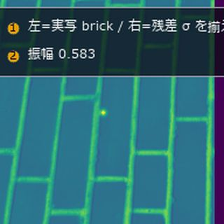<b>&#9654;</b><span>薄缺陷检出极限</span></a>
<a href="../../articles/assets/poc/poc_active_contours/06_u_shape_snakes.mp4">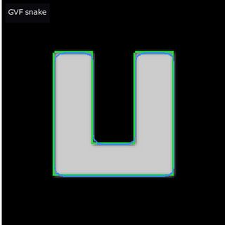<b>&#9654;</b><span>主动轮廓</span></a>
<a href="../../articles/assets/poc/poc_dic_strain/05_tensile_ramp.mp4">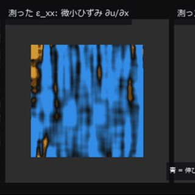<b>&#9654;</b><span>DIC 应变</span></a>
<a href="../../articles/assets/poc/poc_focus_stacking/05_focus_sweep.mp4">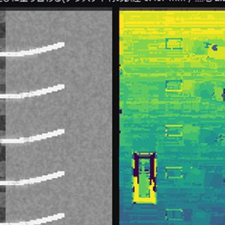<b>&#9654;</b><span>景深合成</span></a>
<a href="../../articles/assets/poc/poc_registration_basin/05_icp_basin_iterations.mp4">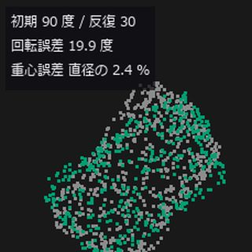<b>&#9654;</b><span>点云配准</span></a>
<a href="../../articles/assets/poc/poc_stockpile_volume/07_scan_orbit.mp4">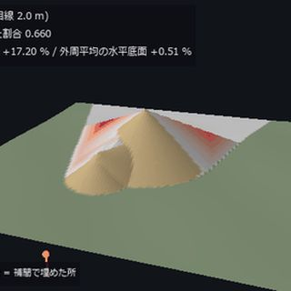<b>&#9654;</b><span>料堆体积</span></a>
<a href="../../articles/assets/poc/poc_ct_fidelity/01_recon_sweep.png">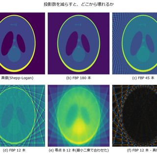<span>CT 重建</span></a>
<a href="../../articles/assets/poc/poc_ct_void_morphology/13_section_sweep.mp4">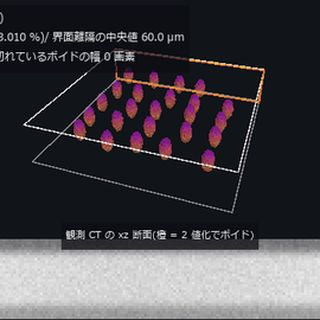<b>&#9654;</b><span>CT 空洞</span></a>
<a href="../../articles/assets/poc/poc_interferometry_step/05_step_sweep.mp4">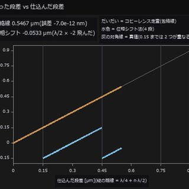<b>&#9654;</b><span>白光干涉台阶</span></a>
<a href="../../articles/assets/poc/poc_polarization_specular/03_separation.png">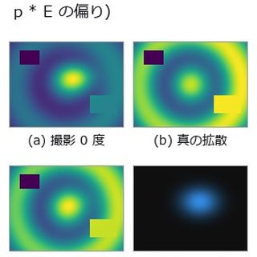<span>偏振去镜面反射</span></a>
<a href="../../articles/assets/poc/poc_photoelasticity/03_load_and_isoclinics.mp4">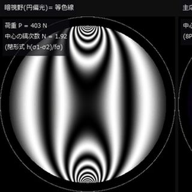<b>&#9654;</b><span>光弹性应力</span></a>
<a href="../../articles/assets/poc/poc_thermography_ndt/02_depth_map.png">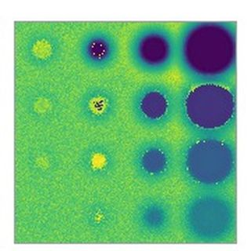<span>热成像缺陷深度</span></a>
<a href="../../articles/assets/poc/poc_motion_magnification/05_magnify_video.mp4">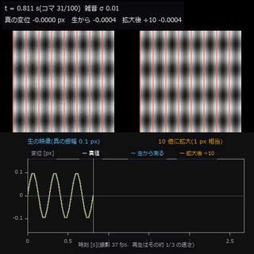<b>&#9654;</b><span>微振动放大</span></a>
<a href="../../articles/assets/poc/poc_table_tennis_bounce/01_drop_test.mp4">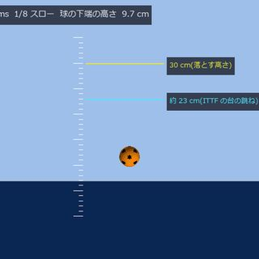<b>&#9654;</b><span>乒乓球弹跳</span></a>
<a href="../../articles/assets/poc/poc_compound_eye/02_compound_eye_superposition.png">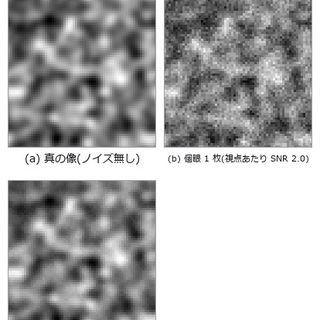<span>复眼光场</span></a>
<a href="../../articles/assets/poc/poc_pegsim_insertion/04_pegsim_insert_corrected.gif">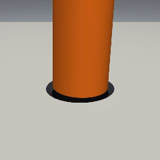<b>&#9654;</b><span>轴孔装配</span></a>
<a href="../../articles/assets/poc/poc_air_hockey_intercept/02_airhockey_prediction_cone_narrows.gif">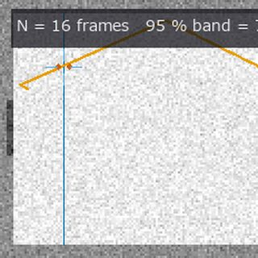<b>&#9654;</b><span>空气曲棍球</span></a>
<a href="../../articles/assets/poc/poc_tacsim_elastic_membrane/03_tacsim_force_sweep.gif">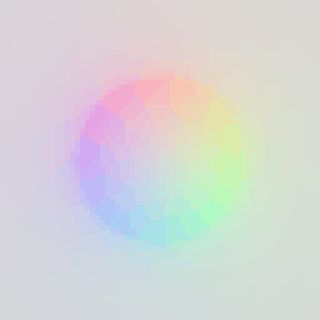<b>&#9654;</b><span>视触觉传感器</span></a>
</div>

## 能看到什么/测得的数字

所有数字都是相对各 PoC 自己植入的真值(闭式、解析解或公开值)的实测;运行 PoC 会打印出相同的值。

<div class="vl" markdown="1">

**图像检测与外观测量**

- [薄缺陷检出极限](../../articles/assets/poc/poc_real_defect_floor/02_defect_floor_sweep.gif) (GIF): 在实拍背景(砖墙)和噪声量相同的合成背景上,逐渐加深同一个植入缺陷。 **即使噪声量相同,实拍背景的检出极限也是合成背景的 2.03〜3.47 倍(针对位置和振幅已知的缺陷)。** [源码](https://github.com/furuse-kazufumi/fullseye/blob/master/examples/poc_real_defect_floor.py)
- [主动轮廓](../../articles/assets/poc/poc_active_contours/06_u_shape_snakes.mp4) (视频): 经典 snake(红)进不了 U 形凹槽,GVF(蓝)能深入到底。绿色是真实边缘。 **只把外力换成 GVF,Dice 达到 0.993(相对真实边缘)。** [源码](https://github.com/furuse-kazufumi/fullseye/blob/master/examples/poc_active_contours.py)
- [DIC 应变](../../articles/assets/poc/poc_dic_strain/05_tensile_ramp.mp4) (视频): 拉伸试验加载过程中,从散斑图像读取应变图(试验机同时转动 2 度)。 **真实应变 3000 µε。小应变因转动只读到 2341 µε,Green-Lagrange 为 2961 µε(理论 3005 µε)。** [源码](https://github.com/furuse-kazufumi/fullseye/blob/master/examples/poc_dic_strain.py)

**三维测量与几何处理**

- [景深合成](../../articles/assets/poc/poc_focus_stacking/05_focus_sweep.mp4) (视频): 对焦扫描 17 帧,全焦图像和深度图逐步形成。 **全焦 PSNR 33.69 dB(中间 1 帧 28.52 dB),深度误差 0.467 mm(有纹理区域)。** [源码](https://github.com/furuse-kazufumi/fullseye/blob/master/examples/poc_focus_stacking.py)
- [点云配准](../../articles/assets/poc/poc_registration_basin/05_icp_basin_iterations.mp4) (视频): 从初始旋转偏差 30 / 90 / 150 度开始,ICP 每次迭代 1 步。 **60 次迭代后的旋转误差:30 度和 90 度为 0.6 度(成功),150 度为 179.5 度(失败)。** [源码](https://github.com/furuse-kazufumi/fullseye/blob/master/examples/poc_registration_basin.py)
- [料堆体积](../../articles/assets/poc/poc_stockpile_volume/07_scan_orbit.mp4) (视频): 绕料堆一周,把 3-D 扫描位置从 1 处增加到 3 处。颜色为插值面与真实面之差。 **库存量误差 +17.20 % → +0.05 %(真实底面;体积真值为闭式 3572.6089 m³)。** [源码](https://github.com/furuse-kazufumi/fullseye/blob/master/examples/poc_stockpile_volume.py)

**X 射线 CT 与体数据处理**

- [CT 重建](../../articles/assets/poc/poc_ct_fidelity/01_recon_sweep.png) (图): 用 180 → 12 个投影重新拍摄 Shepp-Logan 体模并重建。 **12 个投影的 FBP(RMSE 0.2576)甚至不如空白图像(0.2420)。质量校验发现 -3.34 % 的缺损,修正为 -0.0099 %。** [源码](https://github.com/furuse-kazufumi/fullseye/blob/master/examples/poc_ct_fidelity.py)
- [CT 空洞](../../articles/assets/poc/poc_ct_void_morphology/13_section_sweep.mp4) (视频): 空洞率几乎相同的 2 种接合层,一边扫描断面一边旋转 3-D 空洞(视频 4.3 MB)。 **空洞率为 2.46 % 对 2.63 %,但到界面距离的中位数为 60.0 µm 对 10.0 µm。** [源码](https://github.com/furuse-kazufumi/fullseye/blob/master/examples/poc_ct_void_morphology.py)

**光学、干涉、偏振**

- [白光干涉台阶](../../articles/assets/poc/poc_interferometry_step/05_step_sweep.mp4) (视频): 植入的台阶从 0 增加到 0.90 µm,用包络线法和相移法测量。 **噪声 1 % 时偏差在 2.4 nm 以内(台阶 50〜500 nm)。相移法在 0.153 µm 处跳变 λ/2。** [源码](https://github.com/furuse-kazufumi/fullseye/blob/master/examples/poc_interferometry_step.py)
- [偏振去镜面反射](../../articles/assets/poc/poc_polarization_specular/03_separation.png) (图): 用偏振去除镜面反射的结果,以及残留误差的形状。 **漫反射分量的误差与闭式 R_p·E 一致,在布儒斯特角 56.31 度处为 0。** [源码](https://github.com/furuse-kazufumi/fullseye/blob/master/examples/poc_polarization_specular.py)
- [光弹性应力](../../articles/assets/poc/poc_photoelasticity/03_load_and_isoclinics.mp4) (视频): 圆盘加载时条纹不断涌出,旋转偏振片时等倾线随之移动。 **中心条纹级数 2.38(与闭式一致)。op 的偏振系统与教科书公式最大差 2.2e-16。** [源码](https://github.com/furuse-kazufumi/fullseye/blob/master/examples/poc_photoelasticity.py)

**热、声学、时间序列**

- [热成像缺陷深度](../../articles/assets/poc/poc_thermography_ndt/02_depth_map.png) (图): 根据闪光加热后的表面温度读出 16 个剥离缺陷深度的地图。 **深 0.5 mm、直径 2 mm 的缺陷:拟合时间窗 25 秒时为 +612 %,缩到 4 秒时为 -9 %。** [源码](https://github.com/furuse-kazufumi/fullseye/blob/master/examples/poc_thermography_ndt.py)
- [微振动放大](../../articles/assets/poc/poc_motion_magnification/05_magnify_video.mp4) (视频): 以 0.1 px 振动的表面。左为原始视频,右为放大 10 倍的视频。 **真实振幅 0.1000 px,原始视频测得 0.10012,放大后测得 0.10013 px。放大帮助观看,不提高测量。** [源码](https://github.com/furuse-kazufumi/fullseye/blob/master/examples/poc_motion_magnification.py)
- [乒乓球弹跳](../../articles/assets/poc/poc_table_tennis_bounce/01_drop_test.mp4) (视频): ITTF 球台测试:从 30 cm 落球,从视频读取弹起高度。 **从视频读出的弹起高度 23.0 cm(真值 23.0 cm)。** [源码](https://github.com/furuse-kazufumi/fullseye/blob/master/examples/poc_table_tennis_bounce.py)

**机器人与空间感知**

- [复眼光场](../../articles/assets/poc/poc_compound_eye/02_compound_eye_superposition.png) (图): 把小眼阵列合成为光场传感器,用 N 个小眼叠加同一个点。 **SNR 增益:N=5 时 2.25(√5 = 2.24),N=49 时 5.33(√49 = 7.00)。** [源码](https://github.com/furuse-kazufumi/fullseye/blob/master/examples/poc_compound_eye.py)
- [轴孔装配](../../articles/assets/poc/poc_pegsim_insertion/04_pegsim_insert_corrected.gif) (GIF): 用腕部相机测出孔的位置并靠近,再以柔性手腕插入销钉(MuJoCo)。 **伺服 7 次后真实偏差 2.24 → 0.03 mm。有校正的插入 12 / 12 成功。** [源码](https://github.com/furuse-kazufumi/fullseye/blob/master/examples/poc_pegsim_insertion.py)
- [空气曲棍球](../../articles/assets/poc/poc_air_hockey_intercept/02_airhockey_prediction_cone_narrows.gif) (GIF): 用低分辨率相机跟踪冰球,预测它与防守线的交点。帧越多,预测带越窄。 **交点的 95 % 带:N = 3 帧时 145 mm → N = 16 帧时 7 mm。** [源码](https://github.com/furuse-kazufumi/fullseye/blob/master/examples/poc_air_hockey_intercept.py)
- [视触觉传感器](../../articles/assets/poc/poc_tacsim_elastic_membrane/03_tacsim_force_sweep.gif) (GIF): 用球压弹性膜并增大载荷,从膜的图像读取接触半径。 **相对 Hertz 闭式:接触半径误差 0.05〜0.26 %,载荷误差 0.14〜0.79 %(0.02〜0.12 N)。** [源码](https://github.com/furuse-kazufumi/fullseye/blob/master/examples/poc_tacsim_elastic_membrane.py)

</div>

## Fullseye 是什么

通过 MCP 和 RAG,把包含光学设计、三维测量等传感在内的物理仿真与经典图像处理交给 AI,让它针对每个课题考虑组合方式,并在类型一致性检查和带真值的评估下以对话方式解决课题的平台。开源(Apache-2.0)。

<details markdown="1">
<summary><b>试一试</b> (Python 3.11)</summary>

```
pip install fullseye
git clone https://github.com/furuse-kazufumi/fullseye
cd fullseye
python examples/poc_focus_stacking.py
```

景深合成 PoC 约 20 秒跑完,打印相对真值的数字和 `PASS`。图写入 `out/figures/poc_focus_stacking/`。

</details>

<details markdown="1">
<summary><b>链接</b></summary>

- [GitHub(源代码)](https://github.com/furuse-kazufumi/fullseye)
- [图库(全部图)](../../GALLERY.en.md)
- [查找算子 / 从 AI(RAG)使用](../../AI_RAG_GUIDE.zh.md) · [从 MCP 使用](../../MCP.md) _(ja)_
- [文档索引](../../README.zh.md)

</details>

<details markdown="1">
<summary><b>论文信息</b></summary>

- **题目**: Fullseye：型付き演算子と物理シミュレーションに基づく画像検査・三次元計測基盤 _(ja)_ (基于类型化算子与物理仿真的图像检测与三维测量平台)
- **作者**: 古瀬 和文(个人研究者)
- **发表**: ViEW2026 视觉技术实际应用研讨会
- **论文 PDF**: 2026-11-26 起发布

**摘要(由日文翻译)**: 本文提出开源平台 Fullseye:把图像检测与三维测量的处理组装成声明了输入输出数据类型的算子链,以物理与成像仿真生成的真值进行定量评估,并记录处理流程、评估和失败条件以便复用。它由约 3,000 个类型化算子、在执行前拒绝类型不一致的检查、多语言算子检索(RAG)以及 200 多个带真值的验证程序组成。本文报告代表例的定量评估,以及合成、实测、实机三个验证阶段的区分。

</details>
